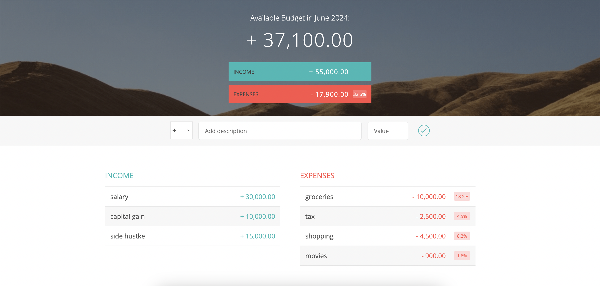

# Budget Tracker

Try yourself: [Live demo](https://voice2post.netlify.app/)


## Description
Track your monthly budget by adding individual incomes and expenses, in order to manage your money more efficiently.


## Instructions
- Add income or expense by toggling between "+" and "-" from select box and add a title and value for both. Each appears at the bottom of stack in their respective columns. 
- Delete any income or expense by just hovering upon them and clicking on the thereafter appearing cross icon.
- Net budget, total income and expense appears at the top, with a percentage depicting total expense as a ratio of total income. Similar, percentage appears alongside of each expense, depicting them as a ratio of total income overall.


## Learnings
1. Use of IIFE to implement data encapsulation and data privacy.
2. Use of function constuctor and prototype.
3. InsertAdjacentHTML(position, html)
    - position could be beforebegin, beforeend, afterbegin, afterend
4. Syntax to delete any HTML node:
    ```
        el.parentNode.removeChild(el);
    ```
5. String.prototype.replace(str, replacementStr). If str is a
    - string, it will replace only first occurrence
    - regex, it will replace all occurrences
6. Syntax for querySelectorAll(selectors)
    - comma separated list of selectors


## Snapshots




